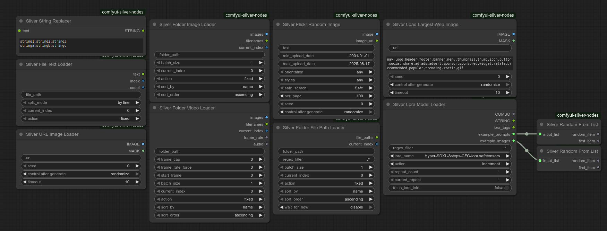

# ComfyUI Silver Nodes

A collection of utility nodes for ComfyUI that enhance workflow capabilities with advanced loaders and processing tools.



## Features

Silver Nodes provides several specialized nodes designed to improve your ComfyUI workflows:

### Loading Nodes

#### Silver URL Image Loader
Load images directly from URLs with cache busting and duplicate prevention.
- **Features**:
  - Cache busting with random query parameters
  - Duplicate detection using content hashing
  - Retry mechanism for failed downloads (5 attempts by default)
  - Supports common image formats (JPEG, PNG, WebP, etc.)
  - Tracks previously loaded images to avoid duplicates
  - **Important**: If image loading fails after all retry attempts, the entire workflow execution will be skipped to prevent partial processing

#### Silver Web Image Loader
Extract and download images from webpages with smart selection.
- **Features**:
  - Analyzes webpage for images with size information
  - Filters out icons, buttons, and other small graphics
  - Excludes common non-content images (logos, ads, etc.)
  - Supports multiple image selection strategies
  - Handles lazy-loaded images and responsive designs
  - Note: "Largest" is determined by HTML attributes, not actual download size

#### Silver Folder Image Loader
Load images from folders with advanced sorting and batching.
- **Features**:
  - Batch loading of multiple images
  - Sorting by name, date modified, or file size
  - Sequential or random access patterns
  - Recursive directory scanning
  - Image format detection and filtering

#### Silver Folder Video Loader
Load and process video frames with audio extraction.
- **Features**:
  - Frame extraction with configurable frame rate
  - Audio track extraction
  - Support for common video formats (MP4, AVI, MOV, etc.)
  - Frame skipping and batching
  - Memory-efficient processing

#### Silver File Text Loader (Beta)
Load and process text files with encoding detection.

> ⚠️ **Note**: This node is currently in beta and has not been fully tested. Some edge cases may not be handled correctly.

- **Features**:
  - Automatic encoding detection
  - Support for multiple text formats (TXT, JSON, CSV, etc.)
  - Line or paragraph splitting
  - Large file handling
  - Error handling for malformed files

#### Silver Folder File Path Loader
Get file paths from folders with regex filtering.
- **Features**:
  - Recursive directory scanning
  - Regex pattern matching
  - Sorting and filtering options
  - Batch processing support
  - File type filtering

### Processing Nodes
- **Silver String Replacer**: Perform text replacements using pattern matching with support for random selection from multiple alternatives
- **Silver Lora Model Loader**: Advanced LORA model loading with filtering and cycling

### Media Nodes

#### Silver Flickr Random Image
Fetch random images from Flickr based on search criteria.
- **Features**:
  - Search by keywords, date ranges, and orientation
  - Safe search filtering
  - Duplicate prevention
  - Configurable image quality
  - Attribution handling
- **Requirements**:
  - Requires a valid Flickr API key
  - Respects Flickr's rate limits
  - Includes proper attribution in output

### Core Features

#### Efficient Resource Management
- Memory-efficient loading and processing
- Configurable caching strategies
- Automatic cleanup of temporary files
- Resource pooling for high-throughput workflows

#### Batch Processing
- Configurable batch sizes
- Parallel processing support
- Progress tracking
- Memory usage monitoring

#### Sequential Processing
- Multiple iteration strategies:
  - Sequential (forward/backward)
  - Random access
  - Loop around
  - Fixed position
- State preservation between executions

#### Sorting Options
- Sort by:
  - Filename (alphabetical)
  - Creation date
  - Modification date
  - File size
  - Custom criteria
- Ascending/descending order
- Natural sorting for numbered files

#### Error Handling
- Graceful degradation
- Detailed error messages
- Retry mechanisms
- Fallback strategies
- Logging and reporting

## Installation

1. Clone this repository into your ComfyUI `custom_nodes` directory:
   ```bash
   cd ComfyUI/custom_nodes
   git clone https://github.com/yourusername/comfyui-silver-nodes.git
   ```
   
2. Restart ComfyUI

## Nodes

### Silver Lora Model Loader

A specialized LoRA model loader that allows cycling through models with various selection strategies.

#### Features

- **Regex Filtering**: Filter LoRA models by name using regular expressions
- **Sequential Selection**: Increment, decrement, or randomize through filtered models
- **Repeat Control**: Apply the same LoRA multiple times before moving to the next

#### Parameters

- `regex_filter`: Regular expression to filter available LoRA models
- `lora_name`: Currently selected LoRA model
- `action`: Selection strategy (fixed, increment, decrement, randomize)
- `repeat_count`: Number of times to use the same LoRA before changing
- `current_repeat`: Current repeat iteration

### Silver Folder Image Loader

Loads images from a specified folder with advanced sorting and selection options.

#### Features

- **Batch Loading**: Load multiple images at once
- **Flexible Sorting**: Sort by name, creation date, modification date, or file size
- **Sort Direction**: Choose ascending or descending order
- **Selection Strategies**: Fixed position, increment, decrement, or wrap-around

#### Parameters

- `folder_path`: Path to the folder containing images
- `batch_size`: Number of images to load at once
- `current_index`: Starting position in the sorted file list
- `action`: Selection strategy (fixed, increment, decrement, increment_wrap, reset)
- `sort_by`: Sorting criterion (name, created, modified, size)
- `sort_order`: Sort direction (ascending, descending)

### Silver File Text Loader

Loads text from files with options for splitting and sequential selection.

#### Features

- **Text Splitting**: Split by line or paragraph
- **Sequential Access**: Increment, decrement, or randomize through text segments

#### Parameters

- `file_path`: Path to the text file
- `split_mode`: How to split the text (by line, by paragraph)
- `current_index`: Current position in the split text
- `action`: Selection strategy (fixed, increment, decrement, randomize)


## Usage Examples

### Cycling Through LoRA Models

1. Add the Silver Lora Model Loader to your workflow
2. Set a regex filter (e.g., "style.*" to match all style LoRAs)
3. Set action to "increment" to cycle through matching models
4. Connect the output to your workflow

### Processing a Folder of Images

1. Add the Silver Folder Image Loader to your workflow
2. Set the folder path containing your images
3. Configure batch size and sorting options
4. Set action to "increment" to process images sequentially
5. Connect the image output to your processing nodes

### Using the String Replacer

The Silver String Replacer node allows you to perform text substitutions with support for random selection from multiple alternatives.

#### Pattern Format

Each replacement rule is defined on a new line in the format:
```
search_term:replacement_1:replacement_2:replacement_3:...
```
- The first part is the text to search for
- Subsequent parts (after colons) are possible replacements
- One replacement is randomly selected when a match is found

#### Example 1: Simple Replacement
```
dog:cat
```
- Replaces all occurrences of "dog" with "cat"

#### Example 2: Multiple Replacements
```
dog:cat:puppy:wolf
```
- Randomly replaces "dog" with either "cat", "puppy", or "wolf"

#### Example 3: Multiple Rules
```
dog:cat:puppy:wolf
house:home:apartment:building
```
- Replaces "dog" with a random animal
- Replaces "house" with a random dwelling

### Using Text Prompts from a File

1. Add the Silver File Text Loader to your workflow
2. Set the path to your text file containing prompts
3. Choose split mode based on how your prompts are formatted
4. Set action to "increment" to use a different prompt each run
5. Connect the text output to your prompt input

## Contributing

Contributions are welcome! Please feel free to submit a Pull Request.